# 🔄 System Workflows - Lexand API

## Overview

This document describes the main business workflows and process flows in the Lexand API system, including sequence diagrams and status transitions.

For detailed module-specific workflows and business rules, refer to:
- **[AUTH.md](modules/AUTH.md)** - Authentication workflows
- **[CUSTOMERS.md](modules/CUSTOMERS.md)** - Customer management workflows

---

## 🔐 Authentication Workflows (Implemented ✅)

### 1. User Registration and Login

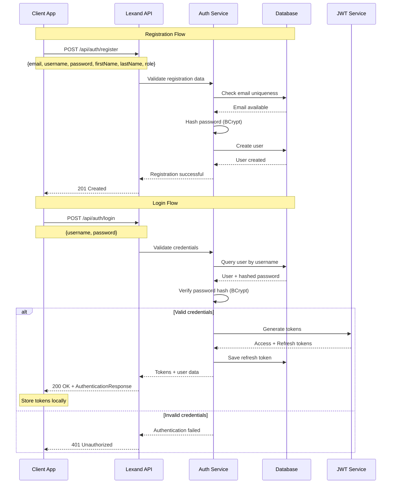
```mermaid
sequenceDiagram
    participant Client as Client App
    participant API as Lexand API
    participant Auth as Auth Service
    participant DB as Database
    participant JWT as JWT Service

    Note over Client,DB: Registration Flow
    Client->>API: POST /api/auth/register
    Note over Client,API: {email, username, password, firstName, lastName, role}
    API->>Auth: Validate registration data
    Auth->>DB: Check email uniqueness
    DB-->>Auth: Email available
    Auth->>Auth: Hash password (BCrypt)
    Auth->>DB: Create user
    DB-->>Auth: User created
    Auth-->>API: Registration successful
    API-->>Client: 201 Created

    Note over Client,DB: Login Flow
    Client->>API: POST /api/auth/login
    Note over Client,API: {username, password}
    API->>Auth: Validate credentials
    Auth->>DB: Query user by username
    DB-->>Auth: User + hashed password
    Auth->>Auth: Verify password hash (BCrypt)
    
    alt Valid credentials
        Auth->>JWT: Generate tokens
        JWT-->>Auth: Access + Refresh tokens
        Auth->>DB: Save refresh token
        Auth-->>API: Tokens + user data
        API-->>Client: 200 OK + AuthenticationResponse
        
        Note over Client: Store tokens locally
    else Invalid credentials
        Auth-->>API: Authentication failed
        API-->>Client: 401 Unauthorized
    end
```

### 2. Token Refresh Flow

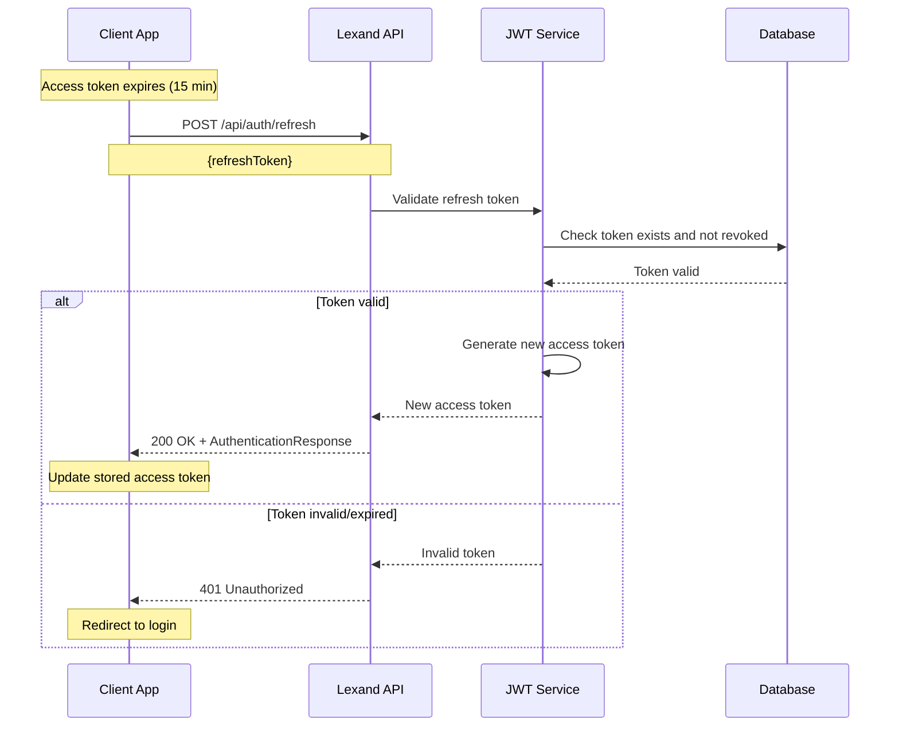
```mermaid
sequenceDiagram
    participant Client as Client App
    participant API as Lexand API
    participant JWT as JWT Service
    participant DB as Database

    Note over Client: Access token expires (15 min)
    
    Client->>API: POST /api/auth/refresh
    Note over Client,API: {refreshToken}
    API->>JWT: Validate refresh token
    JWT->>DB: Check token exists and not revoked
    DB-->>JWT: Token valid
    
    alt Token valid
        JWT->>JWT: Generate new access token
        JWT-->>API: New access token
        API-->>Client: 200 OK + AuthenticationResponse
        Note over Client: Update stored access token
    else Token invalid/expired
        JWT-->>API: Invalid token
        API-->>Client: 401 Unauthorized
        Note over Client: Redirect to login
    end
```

### 3. Logout Flow

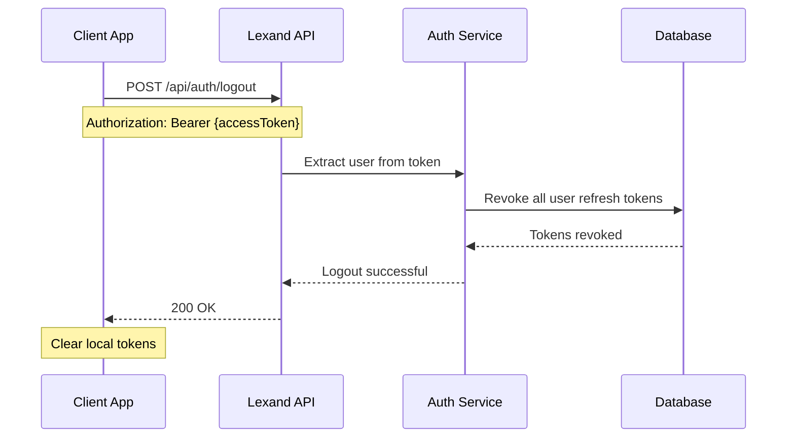
```mermaid
sequenceDiagram
    participant Client as Client App
    participant API as Lexand API
    participant Auth as Auth Service
    participant DB as Database

    Client->>API: POST /api/auth/logout
    Note over Client,API: Authorization: Bearer {accessToken}
    API->>Auth: Extract user from token
    Auth->>DB: Revoke all user refresh tokens
    DB-->>Auth: Tokens revoked
    Auth-->>API: Logout successful
    API-->>Client: 200 OK
    Note over Client: Clear local tokens
```

---

## 👥 Customer Management Workflows (Implemented ✅)

### 4. Create Customer with Aggregate Pattern

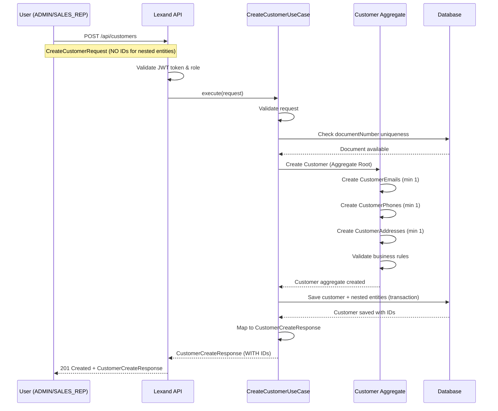
```mermaid
sequenceDiagram
    participant User as User (ADMIN/SALES_REP)
    participant API as Lexand API
    participant UseCase as CreateCustomerUseCase
    participant Domain as Customer Aggregate
    participant DB as Database

    User->>API: POST /api/customers
    Note over User,API: CreateCustomerRequest (NO IDs for nested entities)
    API->>API: Validate JWT token & role
    API->>UseCase: execute(request)
    
    UseCase->>UseCase: Validate request
    UseCase->>DB: Check documentNumber uniqueness
    DB-->>UseCase: Document available
    
    UseCase->>Domain: Create Customer (Aggregate Root)
    Domain->>Domain: Create CustomerEmails (min 1)
    Domain->>Domain: Create CustomerPhones (min 1)
    Domain->>Domain: Create CustomerAddresses (min 1)
    Domain->>Domain: Validate business rules
    Domain-->>UseCase: Customer aggregate created
    
    UseCase->>DB: Save customer + nested entities (transaction)
    DB-->>UseCase: Customer saved with IDs
    
    UseCase->>UseCase: Map to CustomerCreateResponse
    UseCase-->>API: CustomerCreateResponse (WITH IDs)
    API-->>User: 201 Created + CustomerCreateResponse
```

### 5. Update Customer - "Replace All" Strategy

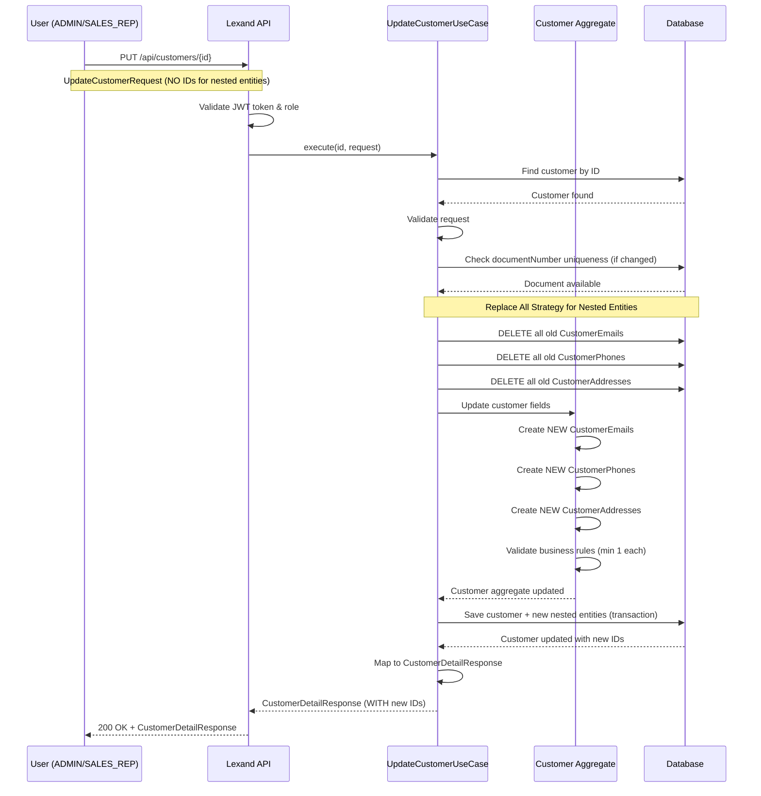
```mermaid
sequenceDiagram
    participant User as User (ADMIN/SALES_REP)
    participant API as Lexand API
    participant UseCase as UpdateCustomerUseCase
    participant Domain as Customer Aggregate
    participant DB as Database

    User->>API: PUT /api/customers/{id}
    Note over User,API: UpdateCustomerRequest (NO IDs for nested entities)
    API->>API: Validate JWT token & role
    API->>UseCase: execute(id, request)
    
    UseCase->>DB: Find customer by ID
    DB-->>UseCase: Customer found
    
    UseCase->>UseCase: Validate request
    UseCase->>DB: Check documentNumber uniqueness (if changed)
    DB-->>UseCase: Document available
    
    Note over UseCase,DB: Replace All Strategy for Nested Entities
    
    UseCase->>DB: DELETE all old CustomerEmails
    UseCase->>DB: DELETE all old CustomerPhones
    UseCase->>DB: DELETE all old CustomerAddresses
    
    UseCase->>Domain: Update customer fields
    Domain->>Domain: Create NEW CustomerEmails
    Domain->>Domain: Create NEW CustomerPhones
    Domain->>Domain: Create NEW CustomerAddresses
    Domain->>Domain: Validate business rules (min 1 each)
    Domain-->>UseCase: Customer aggregate updated
    
    UseCase->>DB: Save customer + new nested entities (transaction)
    DB-->>UseCase: Customer updated with new IDs
    
    UseCase->>UseCase: Map to CustomerDetailResponse
    UseCase-->>API: CustomerDetailResponse (WITH new IDs)
    API-->>User: 200 OK + CustomerDetailResponse
```

### 6. Get Customer by ID

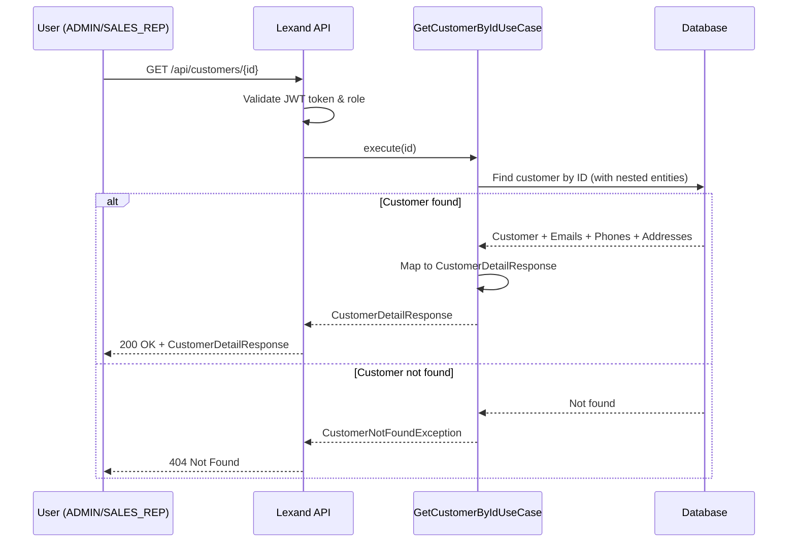
```mermaid
sequenceDiagram
    participant User as User (ADMIN/SALES_REP)
    participant API as Lexand API
    participant UseCase as GetCustomerByIdUseCase
    participant DB as Database

    User->>API: GET /api/customers/{id}
    API->>API: Validate JWT token & role
    API->>UseCase: execute(id)
    
    UseCase->>DB: Find customer by ID (with nested entities)
    
    alt Customer found
        DB-->>UseCase: Customer + Emails + Phones + Addresses
        UseCase->>UseCase: Map to CustomerDetailResponse
        UseCase-->>API: CustomerDetailResponse
        API-->>User: 200 OK + CustomerDetailResponse
    else Customer not found
        DB-->>UseCase: Not found
        UseCase-->>API: CustomerNotFoundException
        API-->>User: 404 Not Found
    end
```

### 7. Delete Customer

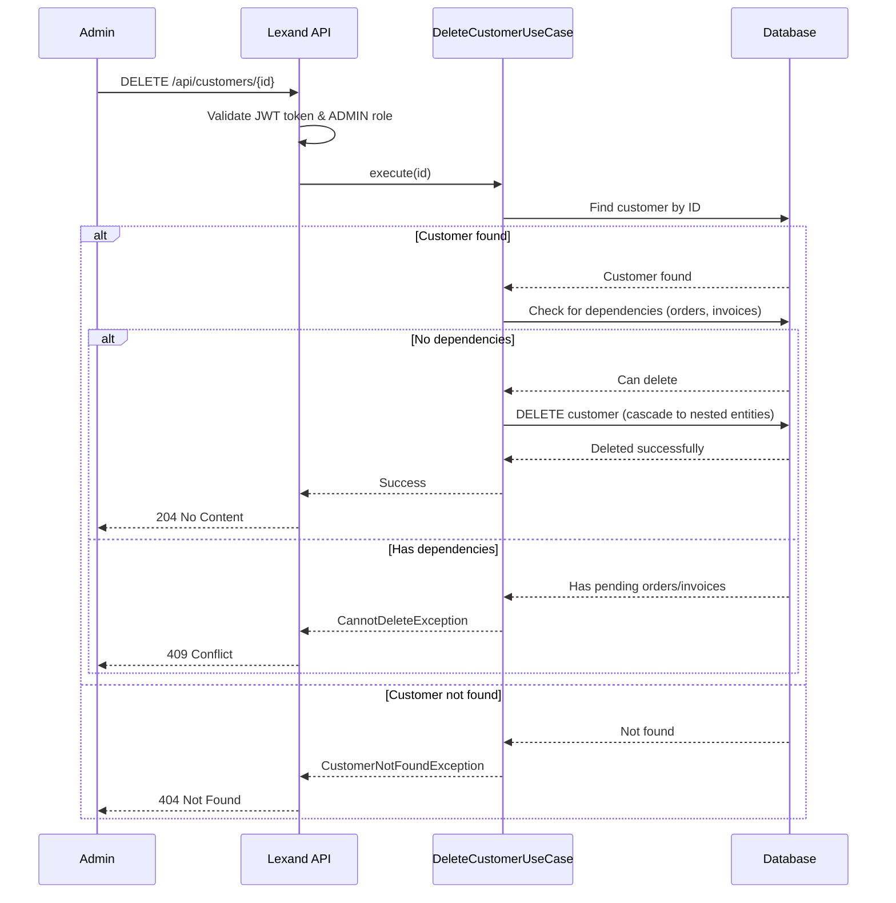
```mermaid
sequenceDiagram
    participant Admin as Admin
    participant API as Lexand API
    participant UseCase as DeleteCustomerUseCase
    participant DB as Database

    Admin->>API: DELETE /api/customers/{id}
    API->>API: Validate JWT token & ADMIN role
    API->>UseCase: execute(id)
    
    UseCase->>DB: Find customer by ID
    
    alt Customer found
        DB-->>UseCase: Customer found
        UseCase->>DB: Check for dependencies (orders, invoices)
        
        alt No dependencies
            DB-->>UseCase: Can delete
            UseCase->>DB: DELETE customer (cascade to nested entities)
            DB-->>UseCase: Deleted successfully
            UseCase-->>API: Success
            API-->>Admin: 204 No Content
        else Has dependencies
            DB-->>UseCase: Has pending orders/invoices
            UseCase-->>API: CannotDeleteException
            API-->>Admin: 409 Conflict
        end
    else Customer not found
        DB-->>UseCase: Not found
        UseCase-->>API: CustomerNotFoundException
        API-->>Admin: 404 Not Found
    end
```

---

## 📦 Product Management Workflows (Implemented ✅)

### 8. Create Simple Product

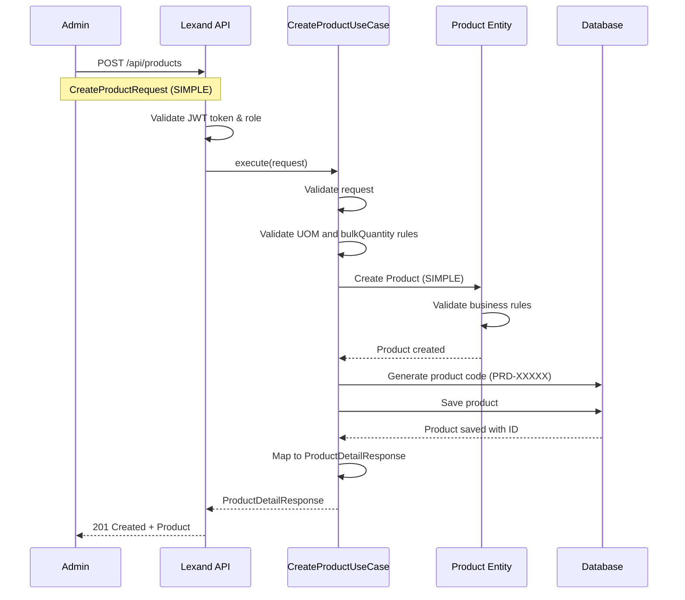
```mermaid
sequenceDiagram
    participant Admin as Admin
    participant API as Lexand API
    participant UseCase as CreateProductUseCase
    participant Domain as Product Entity
    participant DB as Database

    Admin->>API: POST /api/products
    Note over Admin,API: CreateProductRequest (SIMPLE)
    API->>API: Validate JWT token & role
    API->>UseCase: execute(request)
    
    UseCase->>UseCase: Validate request
    UseCase->>UseCase: Validate UOM and bulkQuantity rules
    
    UseCase->>Domain: Create Product (SIMPLE)
    Domain->>Domain: Validate business rules
    Domain-->>UseCase: Product created
    
    UseCase->>DB: Generate product code (PRD-XXXXX)
    UseCase->>DB: Save product
    DB-->>UseCase: Product saved with ID
    
    UseCase->>UseCase: Map to ProductDetailResponse
    UseCase-->>API: ProductDetailResponse
    API-->>Admin: 201 Created + Product
```

### 9. Create Composite Product with Components

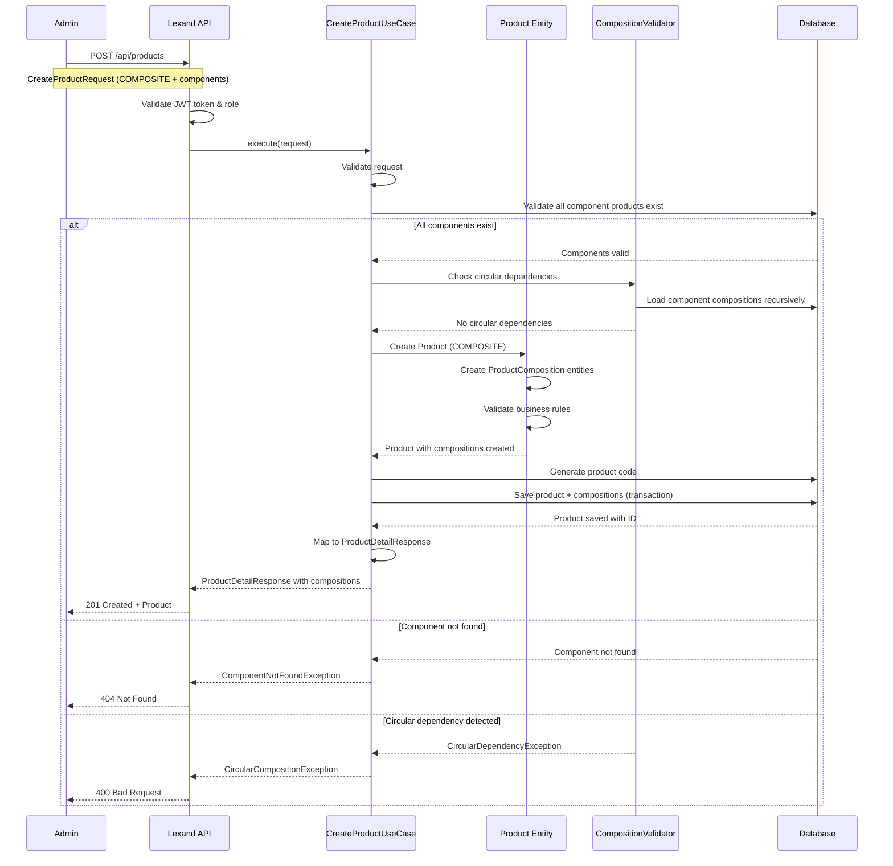
```mermaid
sequenceDiagram
    participant Admin as Admin
    participant API as Lexand API
    participant UseCase as CreateProductUseCase
    participant Domain as Product Entity
    participant Validator as CompositionValidator
    participant DB as Database

    Admin->>API: POST /api/products
    Note over Admin,API: CreateProductRequest (COMPOSITE + components)
    API->>API: Validate JWT token & role
    API->>UseCase: execute(request)
    
    UseCase->>UseCase: Validate request
    UseCase->>DB: Validate all component products exist
    
    alt All components exist
        DB-->>UseCase: Components valid
        
        UseCase->>Validator: Check circular dependencies
        Validator->>DB: Load component compositions recursively
        Validator-->>UseCase: No circular dependencies
        
        UseCase->>Domain: Create Product (COMPOSITE)
        Domain->>Domain: Create ProductComposition entities
        Domain->>Domain: Validate business rules
        Domain-->>UseCase: Product with compositions created
        
        UseCase->>DB: Generate product code
        UseCase->>DB: Save product + compositions (transaction)
        DB-->>UseCase: Product saved with ID
        
        UseCase->>UseCase: Map to ProductDetailResponse
        UseCase-->>API: ProductDetailResponse with compositions
        API-->>Admin: 201 Created + Product
    else Component not found
        DB-->>UseCase: Component not found
        UseCase-->>API: ComponentNotFoundException
        API-->>Admin: 404 Not Found
    else Circular dependency detected
        Validator-->>UseCase: CircularDependencyException
        UseCase-->>API: CircularCompositionException
        API-->>Admin: 400 Bad Request
    end
```

### 10. Add Stock to Simple Product

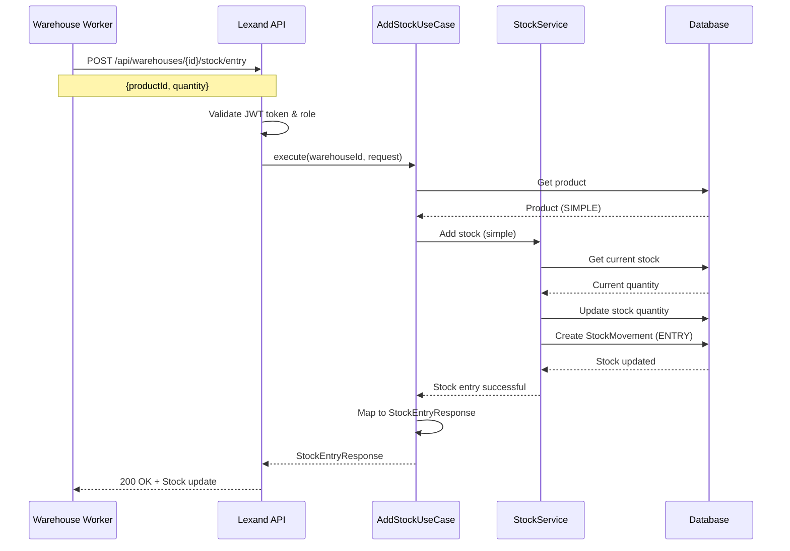
```mermaid
sequenceDiagram
    participant User as Warehouse Worker
    participant API as Lexand API
    participant UseCase as AddStockUseCase
    participant Stock as StockService
    participant DB as Database

    User->>API: POST /api/warehouses/{id}/stock/entry
    Note over User,API: {productId, quantity}
    API->>API: Validate JWT token & role
    API->>UseCase: execute(warehouseId, request)
    
    UseCase->>DB: Get product
    DB-->>UseCase: Product (SIMPLE)
    
    UseCase->>Stock: Add stock (simple)
    Stock->>DB: Get current stock
    DB-->>Stock: Current quantity
    Stock->>DB: Update stock quantity
    Stock->>DB: Create StockMovement (ENTRY)
    DB-->>Stock: Stock updated
    
    Stock-->>UseCase: Stock entry successful
    UseCase->>UseCase: Map to StockEntryResponse
    UseCase-->>API: StockEntryResponse
    API-->>User: 200 OK + Stock update
```

### 11. Add Stock to Composite Product (Auto-Deduct Components)

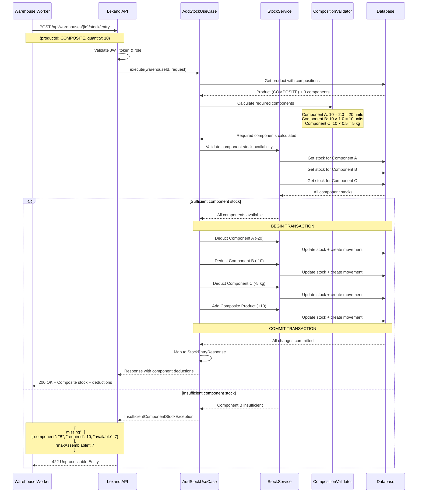
```mermaid
sequenceDiagram
    participant User as Warehouse Worker
    participant API as Lexand API
    participant UseCase as AddStockUseCase
    participant Stock as StockService
    participant Validator as CompositionValidator
    participant DB as Database

    User->>API: POST /api/warehouses/{id}/stock/entry
    Note over User,API: {productId: COMPOSITE, quantity: 10}
    API->>API: Validate JWT token & role
    API->>UseCase: execute(warehouseId, request)
    
    UseCase->>DB: Get product with compositions
    DB-->>UseCase: Product (COMPOSITE) + 3 components
    
    UseCase->>Validator: Calculate required components
    Note over Validator: Component A: 10 × 2.0 = 20 units<br/>Component B: 10 × 1.0 = 10 units<br/>Component C: 10 × 0.5 = 5 kg
    Validator-->>UseCase: Required components calculated
    
    UseCase->>Stock: Validate component stock availability
    Stock->>DB: Get stock for Component A
    Stock->>DB: Get stock for Component B
    Stock->>DB: Get stock for Component C
    DB-->>Stock: All component stocks
    
    alt Sufficient component stock
        Stock-->>UseCase: All components available
        
        Note over UseCase,DB: BEGIN TRANSACTION
        
        UseCase->>Stock: Deduct Component A (-20)
        Stock->>DB: Update stock + create movement
        
        UseCase->>Stock: Deduct Component B (-10)
        Stock->>DB: Update stock + create movement
        
        UseCase->>Stock: Deduct Component C (-5 kg)
        Stock->>DB: Update stock + create movement
        
        UseCase->>Stock: Add Composite Product (+10)
        Stock->>DB: Update stock + create movement
        
        Note over UseCase,DB: COMMIT TRANSACTION
        
        DB-->>UseCase: All changes committed
        UseCase->>UseCase: Map to StockEntryResponse
        UseCase-->>API: Response with component deductions
        API-->>User: 200 OK + Composite stock + deductions
    else Insufficient component stock
        Stock-->>UseCase: Component B insufficient
        UseCase-->>API: InsufficientComponentStockException
        Note over API,User: {<br/>  "missing": [<br/>    {"component": "B", "required": 10, "available": 7}<br/>  ],<br/>  "maxAssemblable": 7<br/>}
        API-->>User: 422 Unprocessable Entity
    end
```

### 12. Get Product with Max Assemblable Units

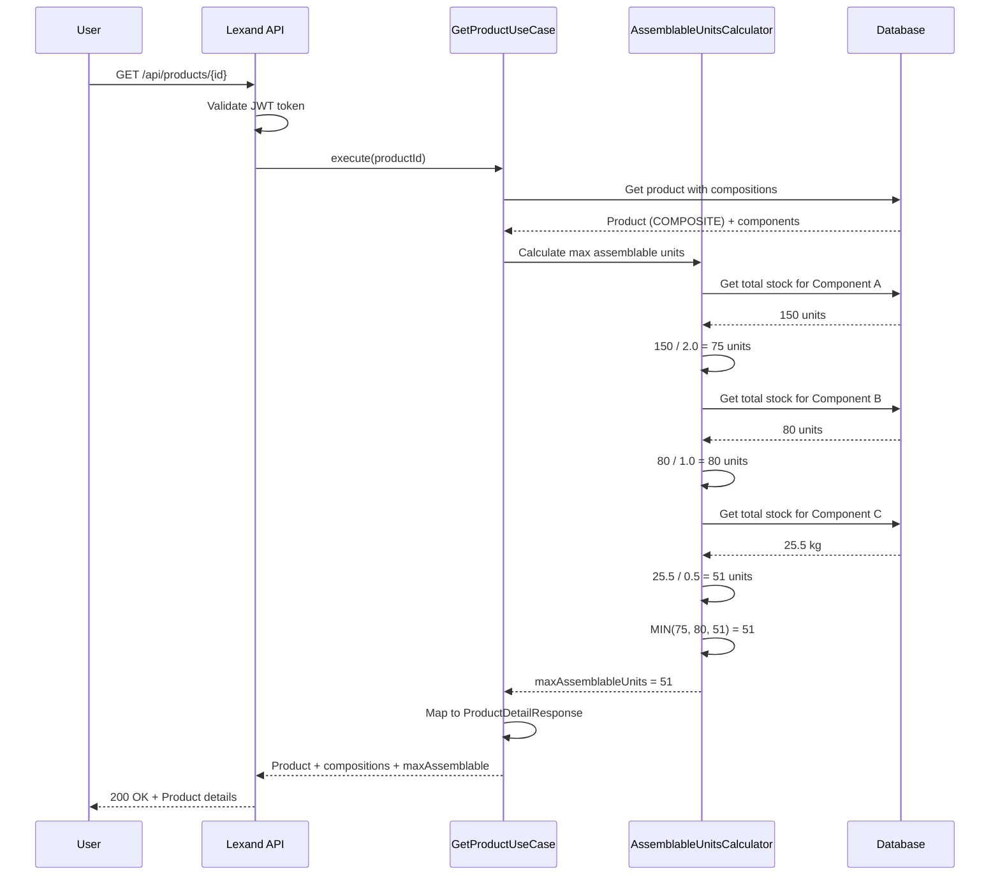
```mermaid
sequenceDiagram
    participant User as User
    participant API as Lexand API
    participant UseCase as GetProductUseCase
    participant Calculator as AssemblableUnitsCalculator
    participant DB as Database

    User->>API: GET /api/products/{id}
    API->>API: Validate JWT token
    API->>UseCase: execute(productId)
    
    UseCase->>DB: Get product with compositions
    DB-->>UseCase: Product (COMPOSITE) + components
    
    UseCase->>Calculator: Calculate max assemblable units
    
    Calculator->>DB: Get total stock for Component A
    DB-->>Calculator: 150 units
    Calculator->>Calculator: 150 / 2.0 = 75 units
    
    Calculator->>DB: Get total stock for Component B
    DB-->>Calculator: 80 units
    Calculator->>Calculator: 80 / 1.0 = 80 units
    
    Calculator->>DB: Get total stock for Component C
    DB-->>Calculator: 25.5 kg
    Calculator->>Calculator: 25.5 / 0.5 = 51 units
    
    Calculator->>Calculator: MIN(75, 80, 51) = 51
    Calculator-->>UseCase: maxAssemblableUnits = 51
    
    UseCase->>UseCase: Map to ProductDetailResponse
    UseCase-->>API: Product + compositions + maxAssemblable
    API-->>User: 200 OK + Product details
```

### 13. Update Product Composition (Replace All)

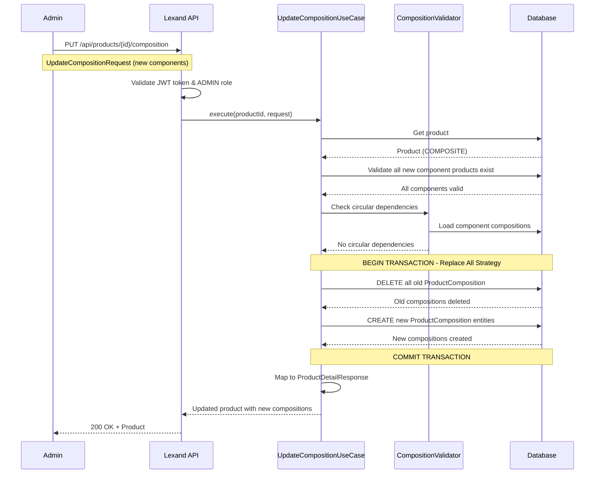
```mermaid
sequenceDiagram
    participant Admin as Admin
    participant API as Lexand API
    participant UseCase as UpdateCompositionUseCase
    participant Validator as CompositionValidator
    participant DB as Database

    Admin->>API: PUT /api/products/{id}/composition
    Note over Admin,API: UpdateCompositionRequest (new components)
    API->>API: Validate JWT token & ADMIN role
    API->>UseCase: execute(productId, request)
    
    UseCase->>DB: Get product
    DB-->>UseCase: Product (COMPOSITE)
    
    UseCase->>DB: Validate all new component products exist
    DB-->>UseCase: All components valid
    
    UseCase->>Validator: Check circular dependencies
    Validator->>DB: Load component compositions
    Validator-->>UseCase: No circular dependencies
    
    Note over UseCase,DB: BEGIN TRANSACTION - Replace All Strategy
    
    UseCase->>DB: DELETE all old ProductComposition
    DB-->>UseCase: Old compositions deleted
    
    UseCase->>DB: CREATE new ProductComposition entities
    DB-->>UseCase: New compositions created
    
    Note over UseCase,DB: COMMIT TRANSACTION
    
    UseCase->>UseCase: Map to ProductDetailResponse
    UseCase-->>API: Updated product with new compositions
    API-->>Admin: 200 OK + Product
```

### 14. Complete Composite Product Lifecycle

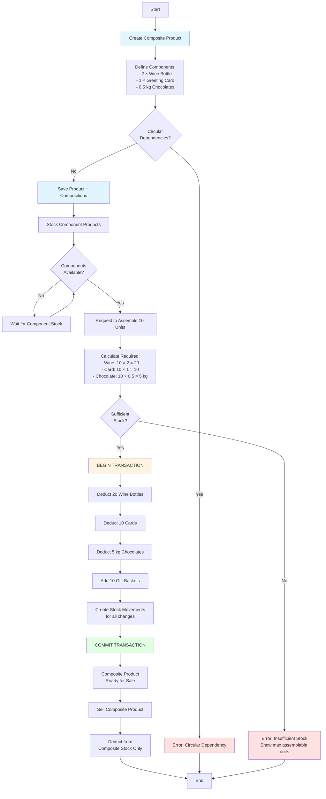
```mermaid
flowchart TD
    Start[Start] --> CreateComposite[Create Composite Product]
    CreateComposite --> DefineComponents[Define Components:<br/>- 2 × Wine Bottle<br/>- 1 × Greeting Card<br/>- 0.5 kg Chocolates]
    
    DefineComponents --> ValidateCircular{Circular<br/>Dependencies?}
    ValidateCircular -->|Yes| Error1[Error: Circular Dependency]
    ValidateCircular -->|No| SaveProduct[Save Product + Compositions]
    
    SaveProduct --> StockComponents[Stock Component Products]
    StockComponents --> ComponentsReady{Components<br/>Available?}
    
    ComponentsReady -->|No| WaitStock[Wait for Component Stock]
    WaitStock --> ComponentsReady
    
    ComponentsReady -->|Yes| AssembleRequest[Request to Assemble 10 Units]
    
    AssembleRequest --> CalcRequired[Calculate Required:<br/>- Wine: 10 × 2 = 20<br/>- Card: 10 × 1 = 10<br/>- Chocolate: 10 × 0.5 = 5 kg]
    
    CalcRequired --> ValidateStock{Sufficient<br/>Stock?}
    
    ValidateStock -->|No| Error2[Error: Insufficient Stock<br/>Show max assemblable units]
    
    ValidateStock -->|Yes| BeginTx[BEGIN TRANSACTION]
    
    BeginTx --> DeductWine[Deduct 20 Wine Bottles]
    DeductWine --> DeductCard[Deduct 10 Cards]
    DeductCard --> DeductChoc[Deduct 5 kg Chocolates]
    DeductChoc --> AddComposite[Add 10 Gift Baskets]
    AddComposite --> LogMovements[Create Stock Movements<br/>for all changes]
    LogMovements --> CommitTx[COMMIT TRANSACTION]
    
    CommitTx --> StockReady[Composite Product<br/>Ready for Sale]
    
    StockReady --> SellProduct[Sell Composite Product]
    SellProduct --> DeductComposite[Deduct from<br/>Composite Stock Only]
    DeductComposite --> End[End]
    
    Error1 --> End
    Error2 --> End
    
    style CreateComposite fill:#e1f5ff
    style SaveProduct fill:#e1f5ff
    style BeginTx fill:#fff4e1
    style CommitTx fill:#e1ffe1
    style Error1 fill:#ffe1e1
    style Error2 fill:#ffe1e1
```

---

## 📋 Order Processing Workflows (Implemented ✅)

### Order Flow Overview

```
┌─────────────────────────────────────────────────────────────────────────────┐
│                            ORDER LIFECYCLE                                   │
└─────────────────────────────────────────────────────────────────────────────┘

  USER / MERCHANT                    ADMIN / USER                    SISTEMA
        │                                 │                              │
        │  1. Crea pedido                │                              │
        │     (con cliente)              │                              │
        ▼                                │                              │
   ┌─────────┐                           │                              │
   │ PEDIDO  │                           │                              │
   │ PENDING │                           │                              │
   └────┬────┘                           │                              │
        │                                │                              │
        │  (puede cancelar               │                              │
        │   mientras PENDING)            │                              │
        │                                │                              │
        └───────────────────────────────►│  2. Convierte a factura     │
                                         │     (botón)                  │
                                         ▼                              │
                                   ┌───────────┐                        │
                                   │  FACTURA  │                        │
                                   │  EMITIDA  │ ──────────────────────►│
                                   └───────────┘                        │
                                         │                              │
                                         │  3. Cliente paga             │
                                         │     la factura               │
                                         ▼                              │
                                   ┌───────────┐                        │
                                   │  FACTURA  │    Si tiene merchant:  │
                                   │  PAGADA   │ ──comisión generada───►│
                                   └───────────┘                        │
                                                                        │
                                                        (solo si order tiene merchant)
```

### 8. Order Creation by User or Merchant

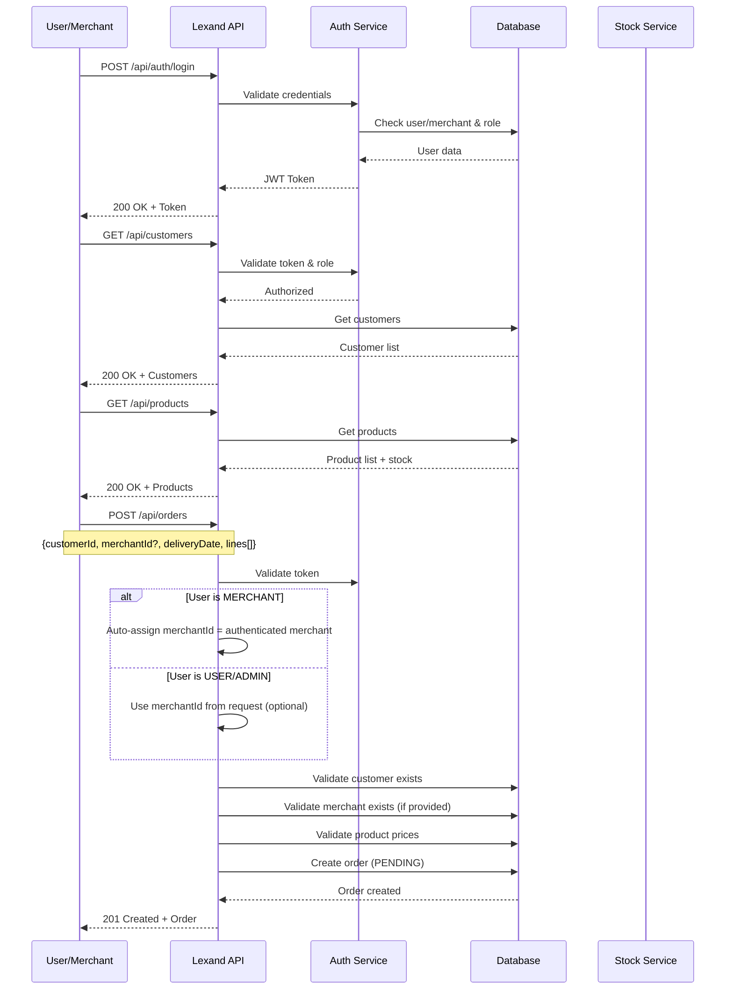
```mermaid
sequenceDiagram
    participant User as User/Merchant
    participant API as Lexand API
    participant Auth as Auth Service
    participant DB as Database
    participant Stock as Stock Service

    User->>API: POST /api/auth/login
    API->>Auth: Validate credentials
    Auth->>DB: Check user/merchant & role
    DB-->>Auth: User data
    Auth-->>API: JWT Token
    API-->>User: 200 OK + Token

    User->>API: GET /api/customers
    API->>Auth: Validate token & role
    Auth-->>API: Authorized
    API->>DB: Get customers
    DB-->>API: Customer list
    API-->>User: 200 OK + Customers

    User->>API: GET /api/products
    API->>DB: Get products
    DB-->>API: Product list + stock
    API-->>User: 200 OK + Products

    User->>API: POST /api/orders
    Note over User,API: {customerId, merchantId?, deliveryDate, lines[]}
    API->>Auth: Validate token
    
    alt User is MERCHANT
        API->>API: Auto-assign merchantId = authenticated merchant
    else User is USER/ADMIN
        API->>API: Use merchantId from request (optional)
    end
    
    API->>DB: Validate customer exists
    API->>DB: Validate merchant exists (if provided)
    API->>DB: Validate product prices
    API->>DB: Create order (PENDING)
    DB-->>API: Order created
    API-->>User: 201 Created + Order
```

### 9. Convert Order to Invoice (USER/ADMIN Only)

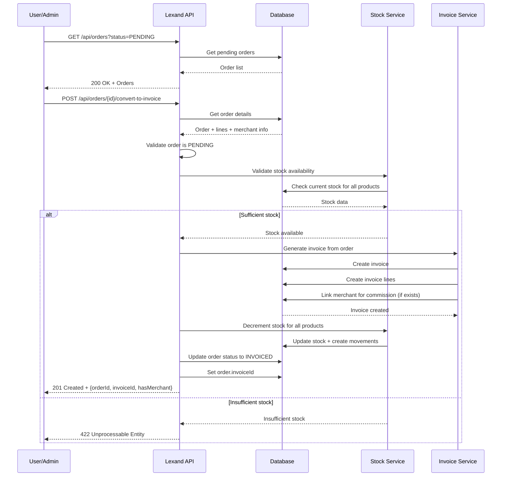
```mermaid
sequenceDiagram
    participant Admin as User/Admin
    participant API as Lexand API
    participant DB as Database
    participant Stock as Stock Service
    participant Invoice as Invoice Service

    Admin->>API: GET /api/orders?status=PENDING
    API->>DB: Get pending orders
    DB-->>API: Order list
    API-->>Admin: 200 OK + Orders

    Admin->>API: POST /api/orders/{id}/convert-to-invoice
    API->>DB: Get order details
    DB-->>API: Order + lines + merchant info
    
    API->>API: Validate order is PENDING
    
    API->>Stock: Validate stock availability
    Stock->>DB: Check current stock for all products
    DB-->>Stock: Stock data
    
    alt Sufficient stock
        Stock-->>API: Stock available
        
        API->>Invoice: Generate invoice from order
        Invoice->>DB: Create invoice
        Invoice->>DB: Create invoice lines
        Invoice->>DB: Link merchant for commission (if exists)
        DB-->>Invoice: Invoice created
        
        API->>Stock: Decrement stock for all products
        Stock->>DB: Update stock + create movements
        
        API->>DB: Update order status to INVOICED
        API->>DB: Set order.invoiceId
        
        API-->>Admin: 201 Created + {orderId, invoiceId, hasMerchant}
    else Insufficient stock
        Stock-->>API: Insufficient stock
        API-->>Admin: 422 Unprocessable Entity
    end
```

### 10. Order Cancellation

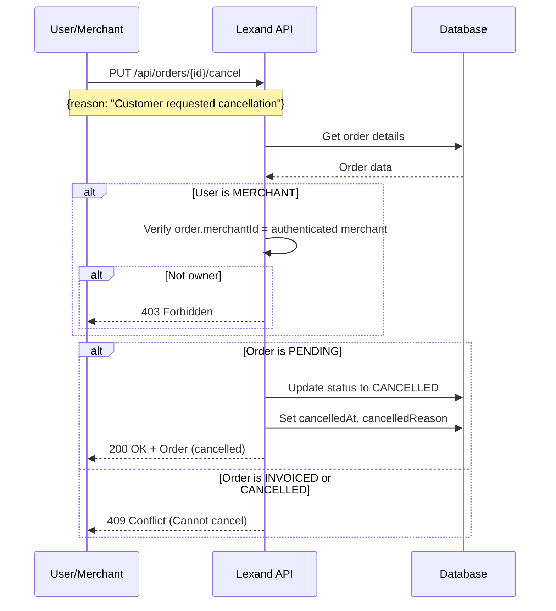
```mermaid
sequenceDiagram
    participant User as User/Merchant
    participant API as Lexand API
    participant DB as Database

    User->>API: PUT /api/orders/{id}/cancel
    Note over User,API: {reason: "Customer requested cancellation"}
    API->>DB: Get order details
    DB-->>API: Order data
    
    alt User is MERCHANT
        API->>API: Verify order.merchantId = authenticated merchant
        alt Not owner
            API-->>User: 403 Forbidden
        end
    end
    
    alt Order is PENDING
        API->>DB: Update status to CANCELLED
        API->>DB: Set cancelledAt, cancelledReason
        API-->>User: 200 OK + Order (cancelled)
    else Order is INVOICED or CANCELLED
        API-->>User: 409 Conflict (Cannot cancel)
    end
```

### 11. Commission Generation on Invoice Payment

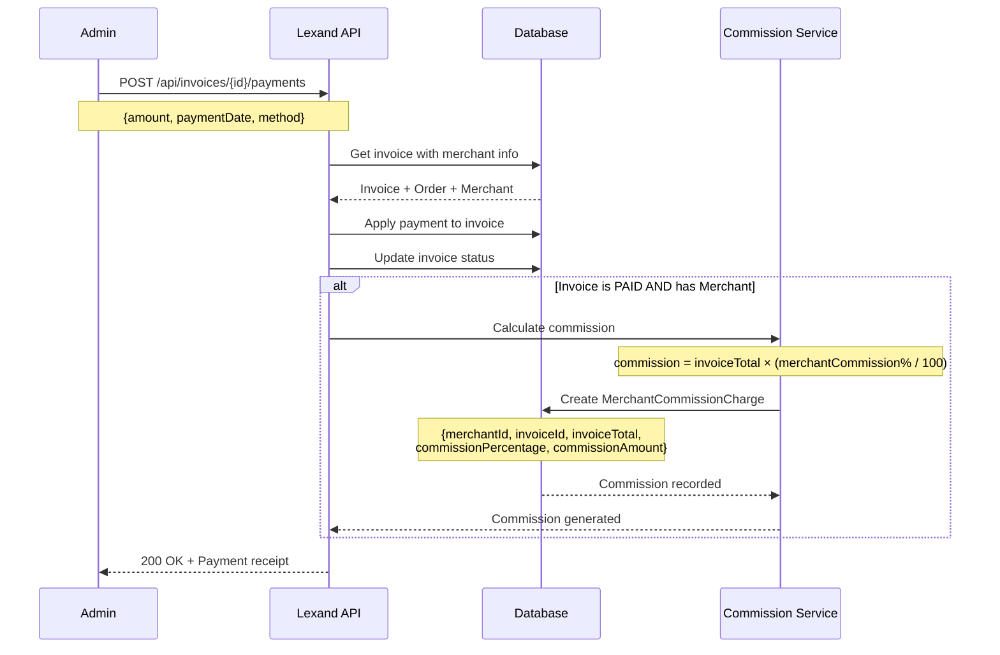
```mermaid
sequenceDiagram
    participant Admin as Admin
    participant API as Lexand API
    participant DB as Database
    participant Commission as Commission Service

    Admin->>API: POST /api/invoices/{id}/payments
    Note over Admin,API: {amount, paymentDate, method}
    API->>DB: Get invoice with merchant info
    DB-->>API: Invoice + Order + Merchant
    
    API->>DB: Apply payment to invoice
    API->>DB: Update invoice status
    
    alt Invoice is PAID AND has Merchant
        API->>Commission: Calculate commission
        Note over Commission: commission = invoiceTotal × (merchantCommission% / 100)
        Commission->>DB: Create MerchantCommissionCharge
        Note over DB: {merchantId, invoiceId, invoiceTotal,<br/>commissionPercentage, commissionAmount}
        DB-->>Commission: Commission recorded
        Commission-->>API: Commission generated
    end
    
    API-->>Admin: 200 OK + Payment receipt
```

### 12. Merchant Views Own Orders

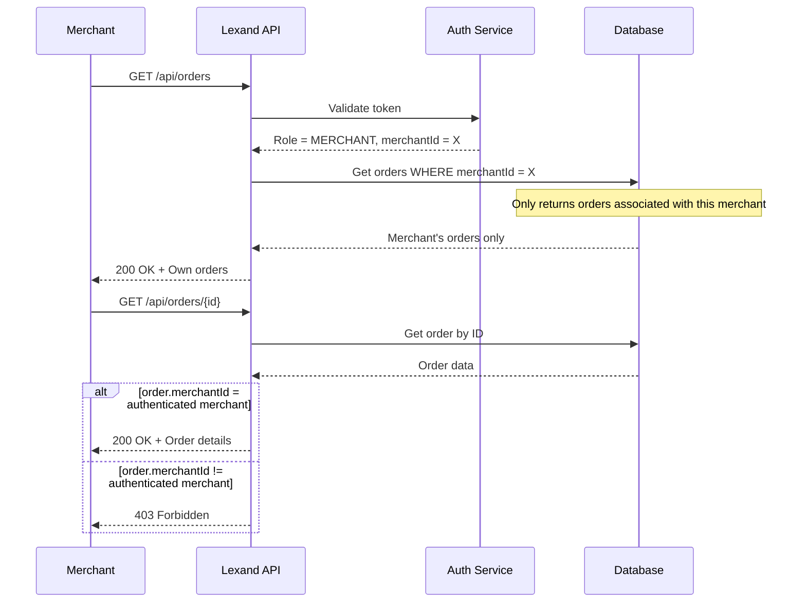
```mermaid
sequenceDiagram
    participant Merchant as Merchant
    participant API as Lexand API
    participant Auth as Auth Service
    participant DB as Database

    Merchant->>API: GET /api/orders
    API->>Auth: Validate token
    Auth-->>API: Role = MERCHANT, merchantId = X
    
    API->>DB: Get orders WHERE merchantId = X
    Note over DB: Only returns orders associated with this merchant
    DB-->>API: Merchant's orders only
    
    API-->>Merchant: 200 OK + Own orders

    Merchant->>API: GET /api/orders/{id}
    API->>DB: Get order by ID
    DB-->>API: Order data
    
    alt order.merchantId = authenticated merchant
        API-->>Merchant: 200 OK + Order details
    else order.merchantId != authenticated merchant
        API-->>Merchant: 403 Forbidden
    end
```

---

## 🧾 Invoice Processing Workflows (Implemented ✅)

### 11. Manual Invoice Creation

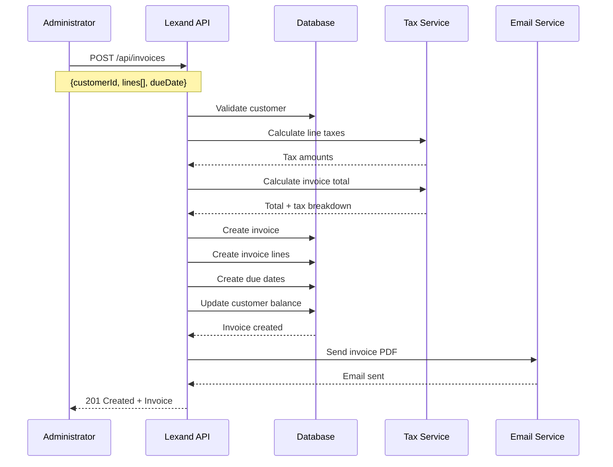
```mermaid
sequenceDiagram
    participant Admin as Administrator
    participant API as Lexand API
    participant DB as Database
    participant Tax as Tax Service
    participant Email as Email Service

    Admin->>API: POST /api/invoices
    Note over Admin,API: {customerId, lines[], dueDate}
    API->>DB: Validate customer
    API->>Tax: Calculate line taxes
    Tax-->>API: Tax amounts
    API->>Tax: Calculate invoice total
    Tax-->>API: Total + tax breakdown
    
    API->>DB: Create invoice
    API->>DB: Create invoice lines
    API->>DB: Create due dates
    API->>DB: Update customer balance
    DB-->>API: Invoice created
    
    API->>Email: Send invoice PDF
    Email-->>API: Email sent
    
    API-->>Admin: 201 Created + Invoice
```

### 12. Invoice Payment Processing

```mermaid
sequenceDiagram
    participant User as User
    participant API as Lexand API
    participant DB as Database
    participant Balance as Balance Service

    User->>API: POST /api/invoices/{id}/payments
    Note over User,API: {amount, paymentDate, method}
    API->>DB: Get invoice and due dates
    DB-->>API: Invoice data
    
    API->>Balance: Apply payment (FIFO)
    Balance->>DB: Update due date statuses
    Balance->>DB: Record payment
    Balance->>DB: Update customer balance
    Balance-->>API: Payment applied
    
    alt Fully paid
        API->>DB: Update invoice status to PAID
    else Partially paid
        API->>DB: Update status to PARTIALLY_PAID
    end
    
    API-->>User: 200 OK + Payment receipt
```

---

## 🏭 Warehouse Workflows (Implemented ✅)

### 14. Stock Transfer Between Warehouses

```mermaid
sequenceDiagram
    participant WH as Warehouse Worker
    participant API as Lexand API
    participant DB as Database
    participant Stock as Stock Service

    WH->>API: POST /api/transfers
    Note over WH,API: {productId, quantity, fromWarehouse, toWarehouse}
    API->>Stock: Validate available stock
    Stock->>DB: Check origin warehouse stock
    DB-->>Stock: Stock data
    
    alt Sufficient stock
        API->>DB: Create transfer (IN_TRANSIT)
        API->>Stock: Decrease origin stock
        Stock->>DB: Update origin + create movement
        API-->>WH: 201 Created + Transfer
    else Insufficient stock
        API-->>WH: 422 Unprocessable Entity
    end

    WH->>API: PUT /api/transfers/{id}/complete
    Note over WH,API: {receivedDate, notes}
    API->>Stock: Increase destination stock
    Stock->>DB: Update destination + create movement
    API->>DB: Update transfer status to COMPLETED
    API-->>WH: 200 OK + Transfer completed
```

### 15. Stock Adjustment (Admin Only)

```mermaid
sequenceDiagram
    participant Admin as Administrator
    participant API as Lexand API
    participant DB as Database
    participant Stock as Stock Service
    participant Audit as Audit Service

    Admin->>API: POST /api/warehouses/{id}/adjust
    Note over Admin,API: {productId, quantity, reason}
    API->>Stock: Calculate adjustment
    Stock->>DB: Get current stock
    DB-->>Stock: Current quantity
    Stock->>DB: Update stock quantity
    Stock->>DB: Create movement (ADJUSTMENT)
    
    API->>Audit: Log adjustment
    Audit->>DB: Create audit record
    Note over Audit,DB: User, timestamp, before/after
    
    API-->>Admin: 200 OK + Updated stock
```

---

## 📊 Status Transition Diagrams

### Order Status Transitions

```mermaid
stateDiagram-v2
    [*] --> PENDING: Create order
    PENDING --> INVOICED: Convert to invoice (USER/ADMIN)
    PENDING --> CANCELLED: Cancel (USER/ADMIN/MERCHANT)
    INVOICED --> [*]
    CANCELLED --> [*]
    
    note right of PENDING
        Can edit/cancel
        Customer required
        Merchant optional
    end note
    
    note right of INVOICED
        Invoice created
        Stock decremented
        Cannot modify
        If merchant: commission on payment
    end note
    
    note right of CANCELLED
        Reason recorded
        No stock impact
        Cannot modify
    end note
```

### Invoice Status Transitions

```mermaid
stateDiagram-v2
    [*] --> DRAFT: Create invoice
    DRAFT --> ISSUED: Issue invoice
    DRAFT --> CANCELLED: Cancel
    ISSUED --> PARTIALLY_PAID: Receive payment
    PARTIALLY_PAID --> PAID: Final payment
    PARTIALLY_PAID --> PARTIALLY_PAID: More payments
    ISSUED --> PAID: Full payment
    PAID --> [*]
    CANCELLED --> [*]
    
    note right of ISSUED
        Sent to customer
        Due dates active
    end note
    
    note right of PARTIALLY_PAID
        Some due dates paid
        Balance remaining
    end note
```

### Stock Transfer Status Transitions

```mermaid
stateDiagram-v2
    [*] --> INITIATED: Create transfer
    INITIATED --> IN_TRANSIT: Start transfer
    INITIATED --> CANCELLED: Cancel
    IN_TRANSIT --> RECEIVED: Arrive at destination
    IN_TRANSIT --> CANCELLED: Cancel
    RECEIVED --> COMPLETED: Confirm receipt
    COMPLETED --> [*]
    CANCELLED --> [*]
    
    note right of INITIATED
        Origin stock reserved
    end note
    
    note right of IN_TRANSIT
        Origin decreased
        Destination pending
    end note
    
    note right of COMPLETED
        Destination increased
        Transfer closed
    end note
```

---

## 🔄 Integration Workflows (Implemented ✅)

### 16. Complete Sales Cycle

```mermaid
flowchart TD
    A[Sales Rep Logs In] --> B[Browse Products]
    B --> C[Select Customer]
    C --> D[Create Order DRAFT]
    D --> E[Add Order Lines]
    E --> F{Review Order}
    F -->|Edit| E
    F -->|Submit| G[Order PENDING]
    
    G --> H[Admin Reviews]
    H --> I{Approve?}
    I -->|No| J[Order CANCELLED]
    I -->|Yes| K[Order APPROVED]
    
    K --> L[Check Stock]
    L --> M{Stock Available?}
    M -->|No| N[Reserve Partial + Notify]
    M -->|Yes| O[Reserve Full Stock]
    
    O --> P[Generate Invoice]
    P --> Q[Invoice ISSUED]
    Q --> R[Send to Customer]
    R --> S[Order INVOICED]
    
    S --> T[Prepare Shipment]
    T --> U[Ship Order]
    U --> V[Order DELIVERED]
    
    Q --> W[Customer Payment]
    W --> X{Full Payment?}
    X -->|Partial| Y[Invoice PARTIALLY_PAID]
    X -->|Full| Z[Invoice PAID]
    Y --> W
    Z --> AA[Update Customer Balance]
    AA --> AB[Release Stock Reservation]
    AB --> AC[End]
    V --> AC
    J --> AC
```

### 10. Complete Purchase Cycle

```mermaid
flowchart TD
    A[Admin Creates Purchase] --> B[Add Purchase Lines]
    B --> C{Link to Products?}
    C -->|Yes| D[Select Products]
    C -->|No| E[Free-form Items]
    D --> F[Purchase PENDING]
    E --> F
    
    F --> G[Send to Supplier]
    G --> H[Admin Approves]
    H --> I[Purchase APPROVED]
    
    I --> J[Await Delivery]
    J --> K[Goods Arrive]
    K --> L[Verify Quantities]
    L --> M{Correct?}
    M -->|No| N[Create Discrepancy Report]
    M -->|Yes| O[Receive Purchase]
    N --> O
    
    O --> P[Update Stock Levels]
    P --> Q[Create Stock Movements]
    Q --> R[Update Product Costs]
    R --> S[Purchase RECEIVED]
    
    S --> T[Create Payment Schedule]
    T --> U[Process Payments]
    U --> V{All Paid?}
    V -->|No| U
    V -->|Yes| W[Purchase CLOSED]
    W --> X[End]
```

---

## 🎯 Real-World Scenario Workflows

### Scenario 1: Field Sales Representative Day

**Morning**: Sales rep drives to client locations

1. **Login** via mobile app (JWT token stored)
2. **Check assigned customers** for the region
3. **Browse product catalog** - check prices and availability
4. At **Customer A**:
   - View customer details and order history
   - Create new order (DRAFT)
   - Add multiple product lines
   - Apply customer discount
   - Submit order (PENDING)
5. At **Customer B**:
   - Similar process
   - Check stock availability before promising delivery
6. **End of day**: Review submitted orders

**Back Office**:
- Admin reviews all PENDING orders
- Approves orders with sufficient stock
- System auto-generates invoices
- Invoices emailed to customers
- Stock reserved for approved orders

### Scenario 2: Warehouse Operations Day

**Morning**: Warehouse worker starts shift

1. **Login** with warehouse role
2. **Check incoming transfers** from other warehouses
3. **Receive transferred goods**:
   - Scan barcodes
   - Confirm quantities
   - Complete transfer (stock updated automatically)
4. **Process outgoing orders**:
   - Pick products for INVOICED orders
   - Pack and ship
   - Mark orders as DELIVERED
5. **Stock count**:
   - Count physical inventory
   - If discrepancies, request admin adjustment
6. **Low stock alerts**:
   - Review products below minimum level
   - Notify admin for purchase order

### Scenario 3: Month-End Financial Close

**Admin Tasks**:

1. **Review pending invoices**:
   - Check all ISSUED invoices
   - Follow up on overdue payments
2. **Process payments received**:
   - Record customer payments
   - Apply to invoices (FIFO)
   - Update customer balances
3. **Review purchase obligations**:
   - Check due dates for supplier payments
   - Prepare payment batch
4. **Generate reports**:
   - Sales by rep
   - Revenue by customer
   - Inventory valuation
   - Accounts receivable aging
5. **Reconciliation**:
   - Match payments to invoices
   - Verify stock movements
   - Close accounting period

---

## 🔐 Authentication Flow

```mermaid
sequenceDiagram
    participant Client as Client App
    participant API as API Server
    participant Auth as Auth Service
    participant DB as Database
    participant JWT as JWT Service

    Client->>API: POST /api/auth/login
    Note over Client,API: {username, password}
    API->>Auth: Validate credentials
    Auth->>DB: Query user
    DB-->>Auth: User + hashed password
    Auth->>Auth: Verify password hash
    
    alt Valid credentials
        Auth->>JWT: Generate tokens
        JWT-->>Auth: Access + Refresh tokens
        Auth->>DB: Save refresh token
        Auth-->>API: Tokens + user data
        API-->>Client: 200 OK + Tokens
        
        Note over Client: Store tokens locally
        
        Client->>API: GET /api/orders (with Bearer token)
        API->>JWT: Validate access token
        JWT-->>API: Token valid + claims
        API->>DB: Get orders
        DB-->>API: Order data
        API-->>Client: 200 OK + Orders
    else Invalid credentials
        Auth-->>API: Authentication failed
        API-->>Client: 401 Unauthorized
    end
    
    Note over Client: Access token expires
    
    Client->>API: POST /api/auth/refresh
    Note over Client,API: {refreshToken}
    API->>JWT: Validate refresh token
    JWT->>DB: Check token not revoked
    DB-->>JWT: Token valid
    JWT->>JWT: Generate new access token
    JWT-->>API: New access token
    API-->>Client: 200 OK + New access token
```

---

[← Back to Documentation](./BUSINESS_RULES.md)
